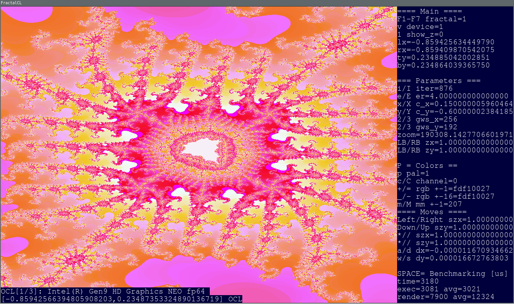

# FractalCL

Discover and explore fractals world with OpenCL acceleration.



# Features

* Interactive animated fractals
* Mouse support to zoom in/out
* Zoom limit set to 43000000000000 for fp64 and 300000 for fp32
* Keyboard support for changing fractals/kernel parameters
* OpenCL support to speed up fractals calculations
* 2 colors models: RGB and HSV
* OpenCL kernels can be executed on CPU without OpenCL libraries
* fp64 support checked at runtime, can be disabled in configuration (configure script)
* Support multiple OpenCL platforms/devices
* Performance tests

# Tested Linux OpenCL implementations

* Neo - Intel Graphics Compute Runtime for OpenCL: https://github.com/intel/compute-runtime
* Beignet - OpenCL Library for Intel GPU's: https://cgit.freedesktop.org/beignet
* OpenCL CPU - OpenCL Runtime for Intel Core and Intel Xeon Processors: https://software.intel.com/en-us/articles/opencl-drivers#latest_CPU_runtime
* Nvidia OpenCL 1.2 CUDA - The NVIDIA Accelerated Graphics Driver Set for Linux-x86_64: http://www.nvidia.com
* Portable Computing Language: http://pocl.sourceforge.net
* AMD GPU - AMDGPU All-Open and AMDGPU-Pro Driver: https://www.amd.com
* ROCm OpenCL - Radeon Open Compute: https://github.com/RadeonOpenCompute

# Mouse usage

* left button - increase zoom
* right button - decrease zoom
* middle button - stop animations

# Keyboard usage

* ESC - exit application
* i/I - increase/decrease number of calculation's iteriations
* c/C/+/=/-/\_/m/M/h/H/j/J/k/K/l/L - change colors
* P - show color palettes
* LEFT/RIGTH - scale horizontally by 0.01
* UP/DOWN - scale vertically
* a/d - shift left/right
* s/w - shift down/up
* e/E - decrease/increase limit for compared modulus
* \*/\/ - scale horizontally and vertically
* p - change color pallette: RGB/HSV
* x/X - decrease/increase c (real part) of complex number (z^2 + c, z^3 + c)
* y/Y - decrease/increase c (imaginary part) of complex number (z^2 + c, z^3 + c)
* F1 - select Julia fractal
* F2 - select Mandelbrot fractal
* F3 - select Julia with gws aligned with window size
* F4 - select dragon fractal
* F5 - select Julia
* F6 - select burning ship
* F7 - select generalized celtic
* F8 - select tricorn
* F9 - modify burning ship
* v - change device used for calculation:
      0 = CPU
      1,..., n = OpenCL device
* 1 - show iterations histogram

# Implemented fractals

Some screenshots with fractals are presented [here](fractals.md)

# Dependencies

* SDL2, SDL2_TTF libraries
* OpenCL library (optional)
* SDL2_GFX library - only for tests

# Build and install instruction

* Run 'configure' script to configure project
* Run 'make' to build project
* Run 'sudo make install' to install application

# Build configuration (configure script)

* FP_64_SUPPORT - Use fp64 extension [ON/OFF] (default ON)
* SDL_ACCELERATED - Use SDL with GPU acceleration [ON/OFF] (default OFF)
* OPENCL_SUPPORT - Use OpenCL acceleration [ON/OFF] (default ON)
* PREFIX - directory where program will be installed

# Run instruction

* Execute 'FractalCL' application. Use mouse and keyboard to change fractals parameters.
* Use keys shown on right panel.
* Press ESC key to exit application.
* Application can be executed with few command line parameters
```
FractalCL -h
-dn - select n OpenCL device
-c  - run performance test on CPU
-l  - list OpenCL devices
-a  - test all OpenCL devices
-t  - run performance test
-i  - number of iterations in performance test
-q  - quiet mode - disable logs
-h  - show help
-v  - show version
-fn - select n fractal type
where n:
      0 - julia
      1 - mandelbrot
      2 - julia (full)
      3 - dragon
      4 - julia 3
      5 - burning ship
      6 - generalized celtic
```

# Tests 

[Directory tests](https://github.com/jdanecki/FractalCL/tree/master/tests) contains simple tests for:

* OpenCL
* SDL
* complex math
* fractals
* gmp and mpfr libraries
* gtk

# Older versions

* [v0.0.1](README-0.0.1.md)

