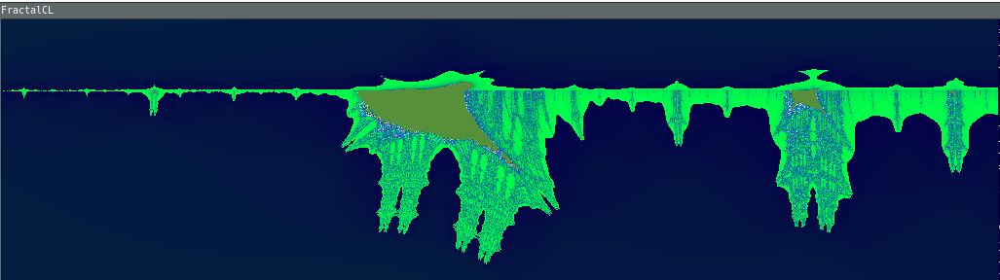
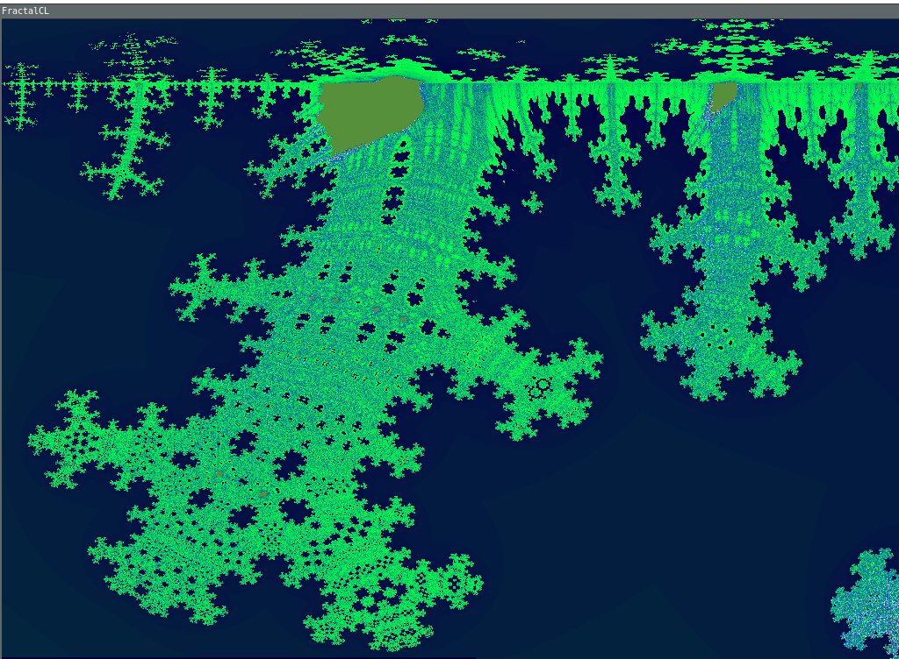
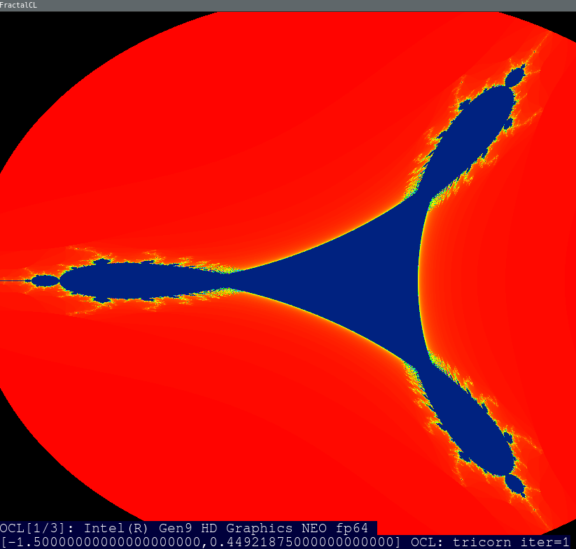

# Implemented fractals

* julia
```
j_x = z_x * z_x - z_y * z_y + c_x;
j_y = 2 * z_x * z_y + c_y;
```


* julia
```
j_x = z_x * z_x * z_x - 3 * z_x * z_y * z_y + c_x;
j_y = 3 * z_x * z_x * z_y - z_y * z_y * z_y + c_y;
```


* mandelbrot
```
j_x = z_x * z_x - z_y * z_y + c_x;
j_y = 2 * z_x * z_y + c_y;
```


* burning ship
```
j_x = z_x * z_x - z_y * z_y + c_x;
j_y = 2 * fabs(z_x * z_y) + c_y;
```


* zoomed burning ship



* modified zoomed burning ship
```
j_x = fabs(z_x * z_x - z_y * z_y) + c_x;
j_y = 2 * fabs(z_x * z_y) + c_y;
```


* generalized celtic
```
j_x = fabs(z_x * z_x - z_y * z_y) + c_x;
j_y = 2 * z_x * z_y + c_y;
```


* tricorn
```
j_x = z_x * z_x - z_y * z_y + c_x;
j_y = -2 * z_x * z_y + c_y;
```


* dragon
```
random select next point
x1 = -0.3 * xc - 1.0;
y1 = -0.3 * yc + 0.1;
or 
x1 = 0.76 * xc - 0.4 * yc;
y1 = 0.4 * xc + 0.76 * yc;

```


